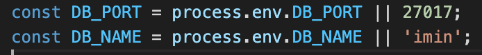
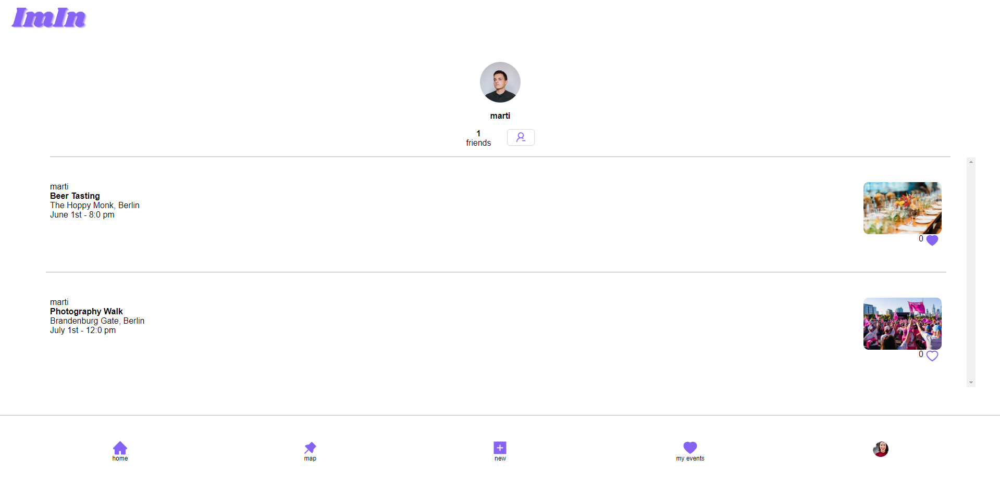
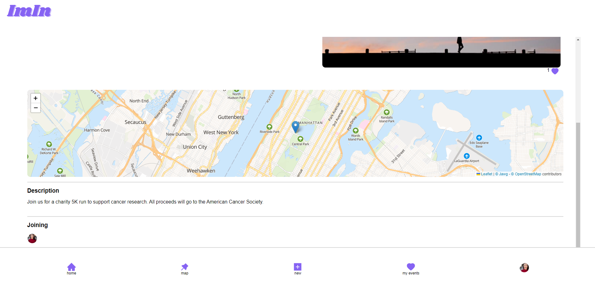

# ImIn app

## Introduction

Welcome to ImIn - a full-stack application built with React, Node, and Express. This app allows users to create plans or events and invite friends to join them. The backend of the application uses MongoDB and Mongoose to store and manage data, while the frontend utilizes Cloudinary to store user-inputted pictures in the cloud. Additionally, the app utilizes the Google Places API to autocomplete addresses and obtain coordinates, and Leaflet to display maps. With ImIn, users can easily create and manage events, share them with friends, and make unforgettable memories. We hope you enjoy using our app!

## Installation

The repo has two folders: One for the front-end, called Client and one for the backend called server.

### Start the database

1. You will need mongodb and mongoose installed in your machine. I recommend also having MongoDb Compass installed to view and edit database data easily.
2. In the file /server/db.js you can see the variables for the mongodb port and database name. You can set your own variables in an .env file or use the default ones.

### Start the server

1. In your terminal navigate to /server and install the dependencies with "npm i".
2. run "npm run express" to start the server.
3. The server will run in "http://localhost:3030/" per default

### Start React

1. In your terminal navigate to /client and install the dependencies with "npm i".
2. run "npm start" to start the React application.
3. The app will run in "http://localhost:3000/" per default.

### Run Tests
1. In your terminal navigate to /client or /server.
2. Run "npm test".

## Structure

### Server

The server follows an MVC pattern, with two main models: USER and Event.
There's a third activeUser Model that was created to handle Authentication but it is still in the works. About authentication, there's a first structure set up with the npm package Passport, but it is not used yet.

In each file of the Models you can see extra annotations about each's properties.

## Tech Stack
### Front End
* TypeScipt
* React
* React leaflet
* React Router
* Ant design
### Back End
* TypeScipt
* Express
* MongoDB
* Supertest
* Node

## Developers
* Eric Jordan - [GitHub](https://github.com/e-jordan-b)
* Adrian Labernia - [GitHub](https://github.com/adri14233)
* Aina Perez - [GitHub](https://github.com/ainaperez)

## Screenshots 

### 

